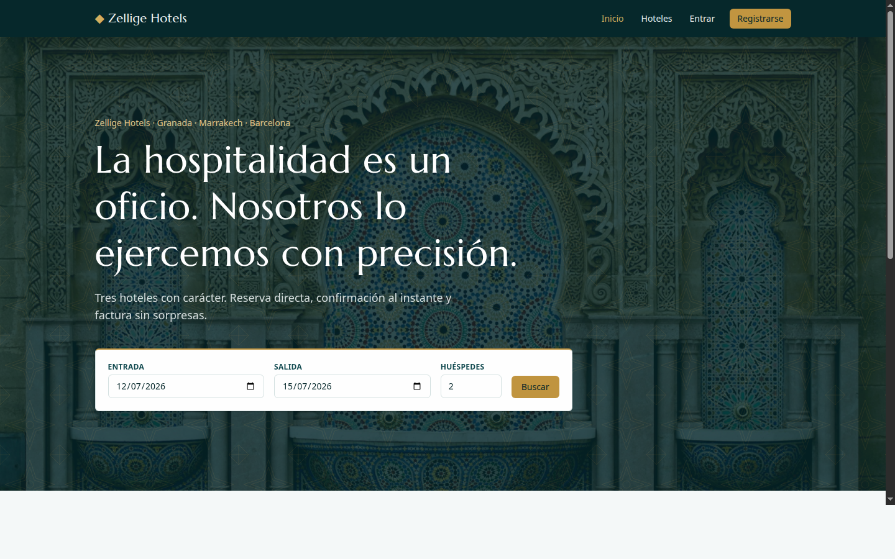
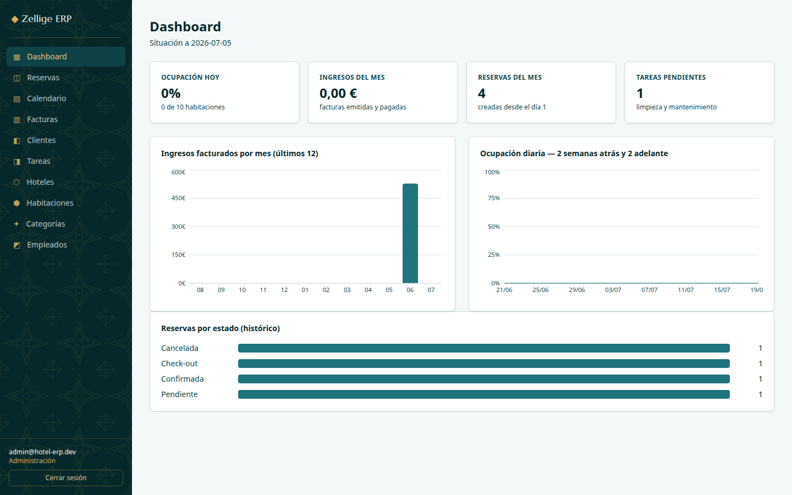
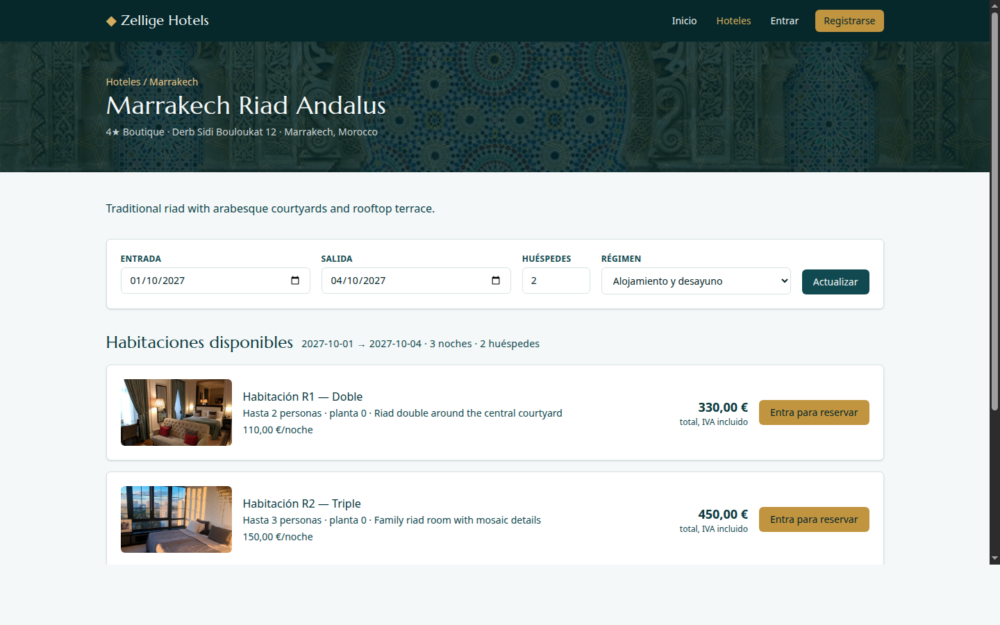

# Hotel ERP

A hotel management platform I built end-to-end as a learning project:
public site with browsing and booking, client self-service area, and a
complete staff ERP (booking lifecycle, invoicing, housekeeping, dashboards).

It's a rewrite of a smaller classroom project — same idea, but rebuilt
properly, with the engineering I wanted to learn: Spring Boot on the
backend, React on the front, real auth, real database constraints, tests
that touch a real Postgres, deployed for the cost of a domain name.



| Admin dashboard | Hotel detail |
|---|---|
|  |  |

## Stack

Spring Boot 3.4 (Java 21) · PostgreSQL + Flyway · JWT with rotating refresh
tokens · React 19 + TypeScript + Tailwind 4 · TanStack Query · Recharts ·
Testcontainers · Docker.

## What's in it

**Public site.** Hotel browsing, search by dates and party size, real-time
availability, direct booking with per-board pricing (room only / B&B / half
board / full board).

**Client area.** My bookings (with cancellation), my invoices (printable,
with VAT breakdown), profile.

**Staff ERP.** Three roles — admin, manager, receptionist. Booking
lifecycle: confirm → check-in → check-out → invoice, with room status
synced and a housekeeping task created automatically. Sequential invoice
numbering (`INV-2026-0001`). Occupancy calendar, task board, full CRUDs
for everything that isn't a guest. Dashboard with KPIs and charts.

**The part I'm most proud of:** the double-booking protection. The
service layer rejects overlapping reservations, *and* the database has a
`EXCLUDE USING gist` constraint as a race-proof backstop. Even if two
receptionists confirm the same room at the same second, the second one
loses.

## Run it locally

You need Java 21, Node 20+ and Docker.

```bash
docker compose up -d                              # Postgres + Mailpit
cd backend && ./mvnw spring-boot:run -Dspring-boot.run.profiles=dev
cd frontend && npm install && npm run dev         # http://localhost:5173
```

Demo accounts (seeded):

| Role | Email | Password |
|---|---|---|
| Admin | `admin@hotel-erp.dev` | `Admin123!` |
| Manager | `manager@hotel-erp.dev` | `Manager123!` |
| Receptionist | `reception@hotel-erp.dev` | `Reception123!` |
| Client | `client@hotel-erp.dev` | `Client123!` |

## Tests

```bash
cd backend && ./mvnw verify          # 28 tests, incl. Testcontainers (real Postgres)
cd frontend && npm test -- --run     # Vitest unit tests
```

CI runs both on every push (`.github/workflows/ci.yml`).

## Architecture

```
backend/  com.ayches.hotelerp        package-by-feature
├── auth/                            JWT issue/refresh/rotation, filters, role rules
├── hotel/ room/ person/             CRUD features: controller → service → repository + DTO/mapper
├── booking/ invoice/ task/          the ERP core (lifecycle state machine, pricing, numbering)
├── dashboard/                       KPI + series aggregation (native SQL, generate_series)
├── notification/                    EmailService: no-op (dev/test) / SMTP (Mailpit local, Brevo prod)
└── resources/db/migration/          Flyway: V1 schema · V2 reference data · V901 images

frontend/  src/
├── api/                             axios + single-flight token refresh, typed endpoints
├── auth/                            AuthContext, role-guarded routes
├── components/ui/                   DataTable, Modal, badges, feedback states
├── pages/{public,account,admin}     16 routes, lazy-loaded
└── styles/theme.css                 tokens (see DESIGN.md)
```

Auth flow: access token in memory, refresh token rotated on every use.
Concurrent 401s share a single refresh (single-flight) so they don't
trip the reuse-detection logic.

## What I learned

A few things that genuinely surprised me while building this:

- **Refresh-token rotation isn't optional.** My first implementation issued
  a long-lived refresh token and called it done. Then I read OWASP properly
  and added rotation with reuse detection: if a token is used twice, the
  whole family is revoked. Cheap to build, very comforting.
- **The `EXCLUDE USING gist` constraint is a hammer.** The first time I
  wrote a "no overlapping bookings" check, it was wrong (off-by-one on the
  checkout day). The second time it was still wrong (timezone handling).
  The third time I let the database do it and the test is one line.
- **TanStack Query changed how I think about frontend state.** I'd been
  carrying `useEffect` + `useState` + manual cache invalidation for years.
  This was the first project where I stopped writing that code.
- **Tailwind 4's CSS-first config is much nicer than v3.** I was
  sceptical. I was wrong.

## What I'd do differently

- The first version of the booking pricing had board-supplement as a free
  number per hotel. It should have been a per-room-night add-on. I refactored
  it but the schema migration is messy.
- I split the front into too many micro-components early. Some files are
  three lines that import from seven places. I'd start with bigger components
  and split only when something actually repeats.
- I should have written the dashboard charts in a different order — the
  data layer went in last and the chart components are now tightly coupled
  to a specific shape.

## Deployment

See **[DEPLOYMENT.md](DEPLOYMENT.md)** for the step-by-step (Render + Neon
+ Vercel + Brevo, all on free tiers).

## License

MIT.
